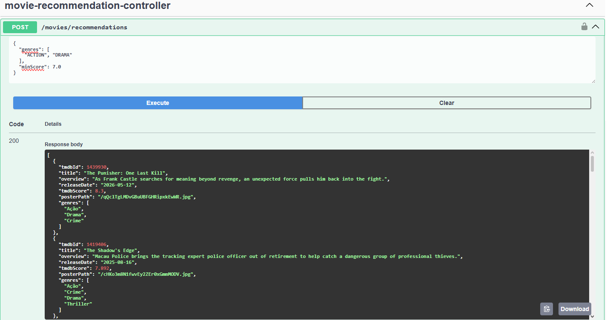

# movie-match


[English README](README.en.md)

API desenvolvida em Java com Spring Boot. O usuário pode solicitar recomendações de filmes e séries, obtendo dados da TMDB (The Movie Database) de acordo com o gênero e a nota mínima especificados, além de gerenciar os filmes/séries assistidos por meio de um CRUD.

## Aprendizados

O projeto foi desenvolvido como forma de estudo, com foco na construção de uma API REST com Spring Boot. Ao longo do desenvolvimento, foram explorados conceitos como injeção de dependência, arquitetura em camadas, modelagem de relacionamentos com JPA, versionamento de schema com Flyway, e autenticação/autorização com Spring Security e JWT.

Em relação à minha experiência pessoal, no início busquei compreender por que e como cada camada do Spring Boot se relacionava. Depois que entendi o fluxo Controller → Service → Repository e as anotações do Spring Boot, consegui continuar desenvolvendo com mais autonomia. Percebi que esse framework exige bastante "mão na massa" para realmente ser compreendido, e esse projeto ajudou muito nesse processo.

## Funcionalidades

- Cadastro e login de usuário com autenticação via JWT
- CRUD de filmes/séries assistidos (criar, listar, editar, remover)
- Recomendação de filmes por gênero e nota mínima, via API da TMDB
- Cada usuário só acessa e modifica os próprios registros

## Stack

- Java
- Spring Boot
- Spring Security + JWT
- Spring Data JPA
- PostgreSQL
- Flyway
- springdoc-openapi (Swagger)

## Exemplo de uso

Requisição e resposta do endpoint de recomendação, filtrando por gênero e nota mínima.



## Como rodar localmente

### Pré-requisitos

- Java 21
- PostgreSQL rodando localmente
- Uma API key da [TMDB](https://www.themoviedb.org/documentation/api)

### Variáveis de ambiente

```
DB_URL=jdbc:postgresql://localhost:5432/moviematch
DB_USERNAME=seu_usuario
DB_PASSWORD=sua_senha
TMDB_API_KEY=seu_read_access_token_da_tmdb
JWT_SECRET=uma_chave_secreta
```

### Rodando

Com o banco criado e as variáveis configuradas, as migrations do Flyway rodam automaticamente na inicialização:

```bash
./mvnw spring-boot:run
```

A aplicação sobe em `http://localhost:8080`.

## Documentação da API

Com a aplicação rodando, a documentação interativa fica disponível em:

```
http://localhost:8080/swagger-ui/index.html
```

Rotas públicas: cadastro (`/users`), login (`/auth/login`) e recomendação (`/movies/recommendations`). O restante exige um token JWT válido no header `Authorization: Bearer <token>`.